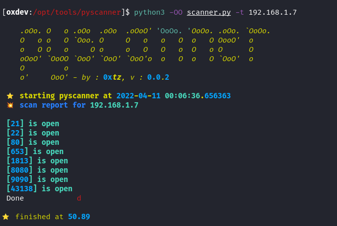

# PYSCANNER



## INFO


## USAGE

```sh
[oxdev:.../tools/pyscanner]$ python3 -OO scanner.py -h            

usage: scanner.py [-h] -t TARGET [-p PORT [PORT ...]] [-f]

A Python Multithreaded TCP Port Scanner

optional arguments:
  -h, --help            show this help message and exit
  -t TARGET, --target TARGET
                        Target IP address
  -p PORT [PORT ...], --port PORT [PORT ...]
                        Specify a port to knock
  -f, --fast            Fast Scan, the top 1k ports

```

### SCANN ALL PORTS

use the host name or IP adress as an arg

```sh

[tz:.../tools/pyscanner]$ python3 -OO scanner.py -t <IP>

```

### Specify some ports

```sh

[tz:.../tools/pyscanner]$ python3 -OO scanner.py -t <IP> -p 22 80 587 ...

```
### fast scan 

-f flag to scann the top used TPC ports 
```bash
[tz:.../tools/pyscanner]$ python3 -OO scanner.py -t <IP> -f

```


## ETC

MORE INFO IS GONNA BE ADDED SOONER haha
